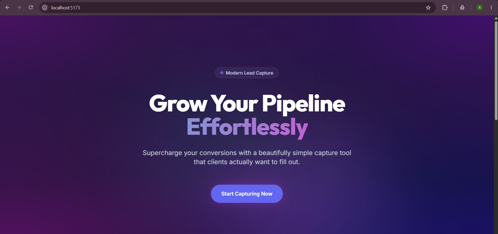
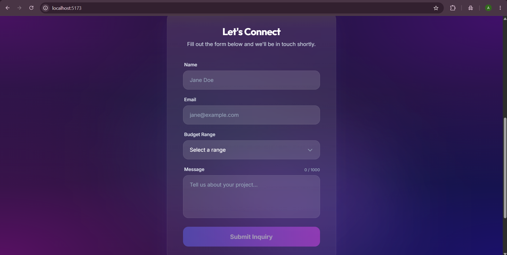
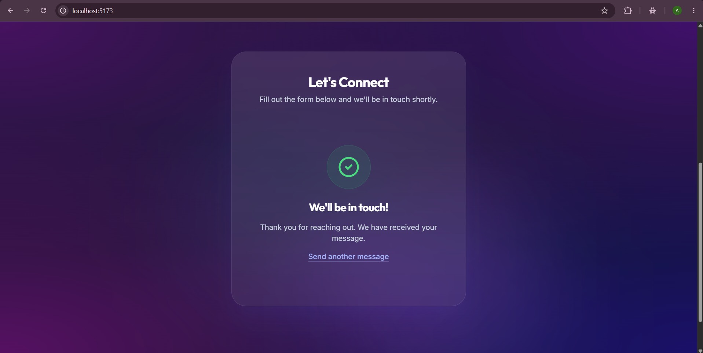
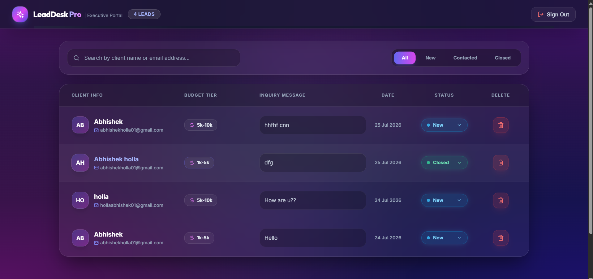

# 🚀 LeadDesk Mini

> A modern, full-stack lead-capture and pipeline management application, built for the **Digital Heroes Full Stack Development Internship Task**.

**🔗 Live App:** [lead-desk-livid.vercel.app](https://lead-desk-livid.vercel.app/)</br>
**🔐 Admin Portal:** [lead-desk-livid.vercel.app/admin/login](https://lead-desk-livid.vercel.app/admin/login)</br>
**💻 Source Code:** [github.com/Abhiho11a/leadDesk](https://github.com/Abhiho11a/leadDesk)

---

## 📖 Table of Contents

- [Overview](#-overview)
- [Screenshots](#-screenshots)
- [Tech Stack](#%EF%B8%8F-tech-stack)
- [Architecture](#-architecture)
- [Data Model](#-data-model)
- [API Reference](#-api-reference)
- [Authentication & Security](#-authentication--security)
- [Local Setup](#-local-setup)
- [Testing the App](#-testing-the-app)
- [Design Decisions](#-design-decisions)
- [AI Usage Disclosure](#-ai-usage-disclosure)

---

## 🌟 Overview

**LeadDesk Mini** solves a simple but common problem: capturing inbound leads from a public landing page and giving an admin a fast, searchable way to manage them through a sales pipeline (`New → Contacted → Closed`).

The app is split into two experiences:

| Side | Purpose |
|---|---|
| 🌐 **Public** | A landing page with a validated lead-capture form |
| 🔐 **Admin** | A password-protected dashboard to search, filter, update, and manage every submitted lead |

Key highlights:
- 🎨 **Modern glassmorphic UI** — animated gradient background, frosted-glass form cards, smooth transitions
- ✅ **Dual-layer validation** — real-time client-side checks + independent server-side schema enforcement, so the API can never be corrupted even if the frontend is bypassed
- 🔒 **Session-based authentication** — `httpOnly` cookies, hashed passwords, server-side session invalidation on logout
- ⚡ **Live pipeline management** — instant search, status filtering, and one-click status updates with optimistic UI

---

## 📸 Screenshots

> Screenshots live in `/docs/screenshots` in this repo.

### Landing Page — Hero


### Lead Capture Form


### Submission Confirmation


### Admin Dashboard — Lead Pipeline


---

## 🛠️ Tech Stack

**Frontend**
- ⚛️ React 18 + Vite
- 🎨 Tailwind CSS
- 🧭 React Router DOM v6
- 🔗 Axios (`withCredentials: true` for session cookies)
- 🖼️ Lucide React (icons)

**Backend**
- 🟢 Node.js + Express
- 🍃 MongoDB + Mongoose
- 🔑 `express-session` + `connect-mongo` (session persistence)
- 🔐 `bcrypt` (password hashing)

**Deployment**
- ▲ Frontend → Vercel
- 🚂 Backend → Render
- 🍃 Database → MongoDB Atlas

---

## 🏗️ Architecture

```
leadDesk/
├── frontend/                 # React + Vite client
│   ├── src/
│   │   ├── pages/
│   │   │   ├── Landing.jsx        # public form + hero
│   │   │   ├── AdminLogin.jsx
│   │   │   └── AdminDashboard.jsx
│   │   ├── components/
│   │   └── services/api.js        # centralized Axios instance
│   └── .env.example
│
├── backend/                  # Node + Express API
│   ├── models/
│   │   ├── Lead.js
│   │   └── Admin.js
│   ├── routes/
│   │   ├── leads.js
│   │   └── auth.js
│   ├── middleware/
│   │   ├── validate.js
│   │   └── requireAuth.js
│   ├── seedAdmin.js
│   ├── server.js
│   └── .env.example
│
└── screenshots/
```

---

## 🗄️ Data Model

### `Lead`
| Field | Type | Rules |
|---|---|---|
| `name` | String | required, trimmed, min 2 chars |
| `email` | String | required, valid email regex |
| `budgetRange` | String (enum) | `<1k` \| `1k-5k` \| `5k-10k` \| `10k+` |
| `message` | String | required, max 1000 chars |
| `status` | String (enum) | `New` \| `Contacted` \| `Closed` — default `New` |
| `createdAt` | Date | auto-generated |

### `Admin`
| Field | Type | Rules |
|---|---|---|
| `email` | String | required, unique |
| `passwordHash` | String | bcrypt hash — plaintext password is never stored |

**Why enums instead of free text?** Locking `budgetRange` and `status` to a fixed set of values keeps admin-side search/filter reliable and prevents inconsistent data (e.g. `"closed"` vs `"Closed"` vs `"CLOSED"`) from ever entering the pipeline.

---

## 📡 API Reference

Base URL: `https://<your-render-service>.onrender.com/api`

| Method | Endpoint | Protected | Description |
|---|---|:---:|---|
| `GET` | `/` | ❌ | Health check |
| `POST` | `/leads` | ❌ | Create a new lead (server-validated) |
| `GET` | `/leads?search=&status=` | 🔒 | List leads, filter by name/email search and status |
| `PATCH` | `/leads/:id/status` | 🔒 | Update a lead's status |
| `POST` | `/auth/login` | ❌ | Authenticate admin, starts session |
| `POST` | `/auth/logout` | ❌ | Destroys session |
| `GET` | `/auth/me` | 🔒 | Returns current session's admin info |

All protected routes return `401 Unauthorized` if there's no valid session — the `/admin` frontend route redirects to `/admin/login` in that case.

---

## 🔐 Authentication & Security

- **Sessions over JWT** — session ID is stored server-side (MongoDB via `connect-mongo`) and referenced by an `httpOnly` cookie. This means logout is a real, immediate invalidation, not just "forget the token client-side." It also means the session token is never exposed to JavaScript, closing off a common XSS-based token theft vector.
- **Password hashing** — all admin passwords are hashed with `bcrypt` before storage; the plaintext password only ever exists transiently during login comparison.
- **Server-side validation always runs**, independent of the frontend — so a request sent directly via Postman/curl is validated exactly as strictly as one from the UI.
- **CORS** is locked to the deployed frontend origin.

---

## 💻 Local Setup

### Prerequisites
- Node.js v18+
- A MongoDB connection string (local instance or [MongoDB Atlas](https://www.mongodb.com/atlas))

### 1. Backend

```bash
cd backend
npm install
cp .env.example .env
```

Fill in `.env`:
```env
PORT=3000
MONGO_URI=mongodb+srv://<user>:<password>@cluster0.mongodb.net/leaddesk
SESSION_SECRET=replace-with-a-long-random-string
ADMIN_EMAIL=admin@example.com
ADMIN_PASSWORD=choose-a-strong-password
CLIENT_URL=http://localhost:5173
```

Seed the admin user, then start the server:
```bash
npm run seed
npm run dev
```
API runs at `http://localhost:3000`.

### 2. Frontend

```bash
cd frontend
npm install
cp .env.example .env
```

Fill in `.env`:
```env
VITE_API_BASE_URL=http://localhost:3000/api
```

```bash
npm run dev
```
App runs at `http://localhost:5173`.

---

## 🧭 Testing the App

1. Visit the [live landing page](https://lead-desk-livid.vercel.app/) and submit a test lead — try submitting empty first to see validation in action.
2. Visit the [admin login](https://lead-desk-livid.vercel.app/admin/login) and log in.
3. Confirm your test lead appears, search for it by name or email, and toggle its status.
4. Refresh the page to confirm the status change actually persisted to the database.
5. Log out and confirm `/admin` redirects back to the login screen.

**Test credentials** are provided separately in the submission (not committed to this public repo for obvious reasons).

---

## 🎯 Design Decisions

1. **Glassmorphic dark UI** — chosen to feel like a modern SaaS product rather than a generic bootstrapped form, while keeping contrast high enough for accessibility on both the hero copy and form inputs.
2. **Optimistic status updates** — the admin dashboard updates the status badge immediately on click, then confirms with the server, so the interface feels instant rather than waiting on a network round-trip.
3. **Centralized API service layer** (`services/api.js`) — every request goes through one configured Axios instance instead of scattered `fetch()` calls, so the base URL and credentials behavior are defined once.
4. **Delete action on leads** — added beyond the base spec to make the admin dashboard usable for real pipeline hygiene (clearing test/spam entries), while keeping status-toggle as the primary workflow action.

---

## 🤖 AI Usage Disclosure

This project was built using **Antigravity** (AI coding tool) for scaffolding the initial React/Express structure, the Tailwind UI components, and the Mongoose schemas. After the initial generation, I reviewed and modified: [— fill in your specific changes here, e.g. "fixed session persistence across page refresh," "adjusted the color palette and spacing," "rewrote validation error copy," "added the delete-lead feature," "fixed a bug where status updates weren't saving to the DB" —]. I tested every flow manually end-to-end (form validation, auth, search, status persistence) in an incognito browser before deployment.

---

<div align="center">

Built for the **Digital Heroes Internship Task** · [digitalheroesco.com](https://digitalheroesco.com)

</div>
